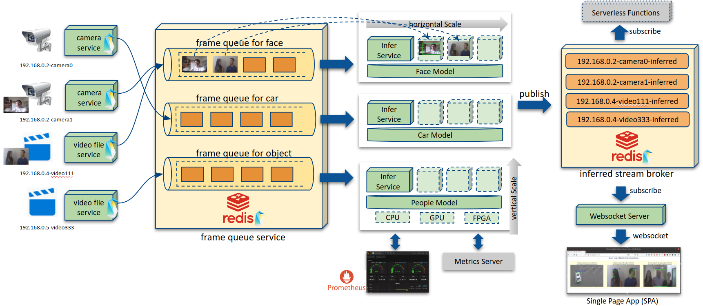

# Clear Linux based Elastic Inference Solution for Edge Computing

## Design Principle
This solution re-architect traditional monolithic inference pipeline to cloud native model. With ClearLinux as container base OS and OpenVINO library, the inference workload can be scaled vertically on heterogeneous hardware engine; while kubernetes also provide HPA(Horizontal POD Autoscaler) for horizontal scale according to the collected metrics from the whole system. The flexible scalability in this solution can help to meet with diverse requirements on Edge computing, such as diverse inference model size, diverse input source, etc.

_(NOTES: This project is only for demo purpose, please do not used in any production.)_


## Architecture



1. **[Camera Stream Service](apps/camera_stream_service.py)/[File Stream Service](apps/file_stream_service.py)**

    The input source could be from camera or video file. There are more than input sources  to produce frames to different inference queues. For example, there are 3 cameras for face detection at the same time, then all frames from these 3 cameras will be produced to face frame queue.

2. **Frame Queue**

    The frames are pushed into several frame queues according to inference type like face, people, car, object etc. The frame queue service is based on redis's RPUSH, LPOP functions.

3. **[Openvino Inference Engine Service](apps/infer_service.py)**

    It pickup individual frame from the stream queue then do inference. For specific inference type (people/face/car/object), there is at least 1 replica. And it could be horizontally pod scaled(HPA) according to collected metrics like drop frame speed, infer FPS or CPU usage on kubernetes. The container image is constructed by ClearLinux's OpenCV 4.0.1(AVX optimized) and OpenVINO middleware.

    With different models' input, the inference service can be used for any recognition or detection. Following models are used in this solution for demo purpose:

    * people/body detection: [SqueezeNetSSD-5Class](https://github.com/intel/Edge-optimized-models/tree/master/SqueezeNet%205-Class%20detection)
    * face detection: uses [face-detection-retail-0005](https://docs.openvinotoolkit.org/2019_R2/_intel_models_face_detection_retail_0005_description_face_detection_retail_0005.html)
    * car detection: uses [person-vehicle-bike-detection-crossroad-0078](https://docs.openvinotoolkit.org/2019_R1/_person_vehicle_bike_detection_crossroad_0078_description_person_vehicle_bike_detection_crossroad_0078.html)

    _Note: This project will not provide above models for downloading, but the container's build script will help to download when constructing the container image on your own._

4. **Stream Broker Service**

    The inference result is sent to stream broker with its IP/name information for further actions like serverless function, dashboard etc. The stream broker also use redis and is the same one for frame queue by default.

5. **[Stream Websocket Server](apps/websocket_server.py)**

    The HTML5 SPA(Single Page Application) could only pull stream via websocket protocol. So this server subscribes all result stream from broker and setup individual websocket connection for each inference result stream.

6. **[SPA Dashboard](spa/src/views/index.vue)**

    It is based on HTML5 and VUE framework. THe front-end will query stream information from gateway via RESTful API `http://<gateway address>/api/stream`, then render all streams by establishing the connection to websocket server `ws://<gateway address>/<stream name>`

7. **[Gateway Server](apps/gateway_server.py)**

    Gateway provides a unified interface for the backend servers:
    * `http://<gateway>`: Dashboard SPA web server
    * `http://<gateway>/api/`: Restful API server
    * `ws://<gateway>/<stream_name>`: Stream websocket server.

## Getting Start

### Prerequisite

This project does not provide the container image, so you need have your own docker registry to build container image for testing and playing. It is easy to get your own registry from http:/hub.docker.com

### Build container image

The [build script](container/build.sh) helps to create all required container images and publish to your own docker registry as follows:

```
./container/build.sh -r <your own registry name>
```
_NOTE: Please get detail options and arguments for build.sh via `./container/build.sh -h`_

### Deploy & Test on kubernetes cluster

1. Generate kubernetes yaml file with your own registry name like:
```
tools/tools/gen-k8s-yaml.sh -f kubernetes/elastic-inference.yaml.template -y <your container registry>
```
2. Deploy the core services as:
```
kubectl apply -f kubernetes/elastic-inference.yaml
```
3. Test by sample video file as:
```
kubectl apply -f kubernetes/sample-infer/
```

After the above steps, the kubernete cluster will expose two services via NodePort:
* `<k8s cluster IP>:31003`
    Frame queue service to accept any external frame producer from IP cameras.
* `<k8s cluster IP>:31002`
    Dashboard SPA web for result preview as follows:


4. Test camera stream producing for inference
```
tools/run-css.sh -v 0 -q <kubernetes cluster address> -p 31002
```
* `-v 0`: for /dev/video0
* `-q <kubernetes cluster address>`: Kubernete cluster external address
* `-p 31002`: By default, the redis base frame queue service is at this port.
_Note: Please get detail options and arguments for run-css.sh script via `./tools/run-css.sh -h`_.
