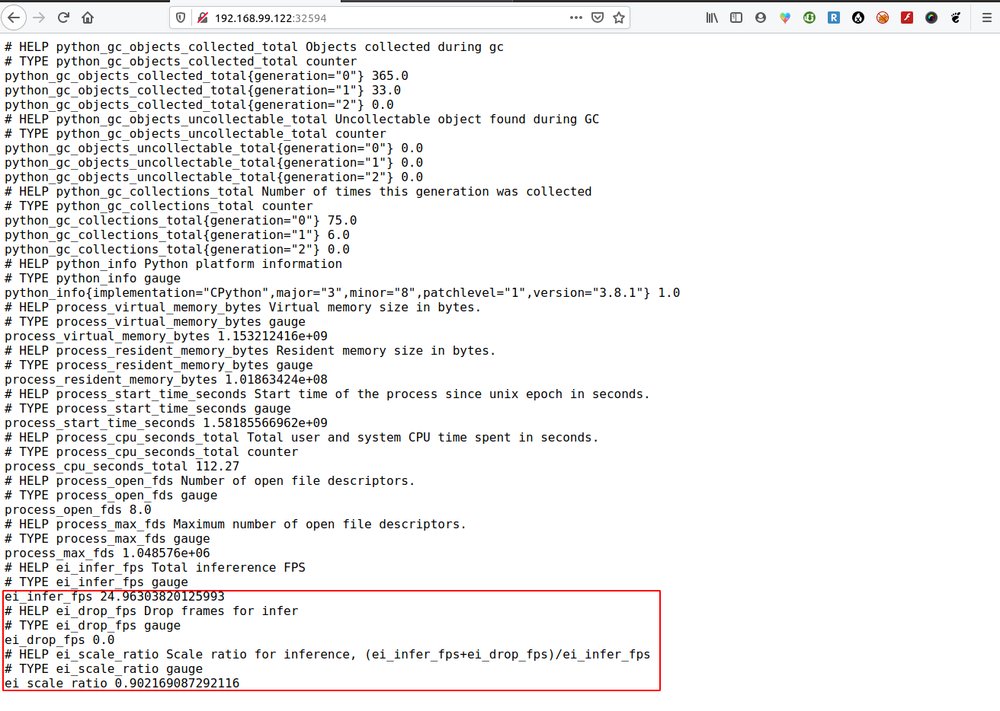

# Inference Metrics

To meaure inference performance and dynamic scale inference resource, following metrics are collected from inference engines.

* Inference rate (FPS): **ei_infer_fps**

  It indicates how many frames was inferenced by a single inference POD. It will be impacted by:
  1. Computation capacibility of inference engine. Inference engine might be accelerated by heterogonous engine or using CPU SIMD instruction like AVX512 VNNI.
  2. Replicas of inference engine for same inference workload. Operator can scale more replicas to balance inference workloads. More replicas, less inference rate for single replica.
  3. Model's computation requirement. For example, object detection may need 20 GFlops computation while face detection might only need 0.5G Flops. More computation of model will result less inference rate.
  
* Drop rate (FPS): **ei_drop_fps**

  It indicates how many frames was dropped without inference. It will be impacted by:
  1. Inference capacbility (computation or replicas) as above mentioned in ei_infer_fps. High inference capaciblity, less drop frames.
  2. Number of streams for same inference type. Because the streams with same inference type were merged into same queue and will be handled by same inference service. So more streams with same inference type, more drop frames.

* Scale Ratio e: **ei_scale_ratio = (ei_infer_fps + ei_drop_fps) / ei_infer_fps**

  It indicate how many replicas need scale to reduce drop frame's speed.

On kubernetes, prometheus + grafana are always used to monitor and visualize the different metrics like service, cluster, node etc. Inference service also report above metrics as service metrics:


Beyond indivdual service's metrics, you can also monitor and visualize the total inference and drop FPS to indicate whole cluster's performance and resource gap.

# Setup Prometheus+Grafana

Since prometheus + grafana is very common monitoring tool but its configuration is a little complex, Kubernete operator might use different ways to setup or CSP ochestrator already provides that. Here steps are based on CoreOS's open source project kube-prometheus at https://github.com/coreos/kube-prometheus.

## Install kube-prometheus

1. Clone latest release

    ```
    git clone https://github.com/coreos/kube-prometheus.git -b release-0.4
    ```

    _(Note: you may use the latest release newer than release-0.4)_

2. Install
    ```
    kubectl apply -f kube-prometheus/manifests/setup/
    kubectl apply -f kube-prometheus/manifests

    # Expose grafana service via NodePort for external access
    kubectl patch svc grafana -n monitoring --type='json' -p '[{"op":"replace","path":"/spec/type","value":"NodePort"}]'

    # Expose prometheus-k8s service via NodePort for external access
    kubectl patch svc prometheus-k8s -n monitoring --type='json' -p '[{"op":"replace","path":"/spec/type","value":"NodePort"}]'
    ```

    After that, you should able to check prometheus and grafana via each NodePort.

## Monitor inference service

To monitor inference service, you need:
    
```
cd cloud-native-demo/elastic_inference/kubernetes/monitoring
kubectl apply -f servicemonitor.yaml
```

# View Inference Metrics

## View from Inference Service

You can read metrics value from inference service after exposing individual inference service via NodePort.

```
kubectl patch svc ei-infer-face-fp32-app --type='json' -p '[{"op":"replace","path":"/spec/type","value":"NodePort"}]'
```



## View from Prometheus

You can monitor metrics from prometheus after exposing prometheus-k8s via NodePort as:

```
# Expose prometheus-k8s service via NodePort for external access
kubectl patch svc prometheus-k8s -n monitoring --type='json' -p '[{"op":"replace","path":"/spec/type","value":"NodePort"}]'
```


## View from Grafana

You can monitor individual and cluster-wide metrics on grafana after exposing grafana service via NodePort.

```
# Expose grafana service via NodePort for external access
kubectl patch svc grafana -n monitoring --type='json' -p '[{"op":"replace","path":"/spec/type","value":"NodePort"}]'
```

You also need create customize graph and add following metrics:
- ei_infer_fps
- ei_drop_fps
- sum(ei_infer_fps)
- sum(ei_drop_fps)
- ei_scale_ratio


